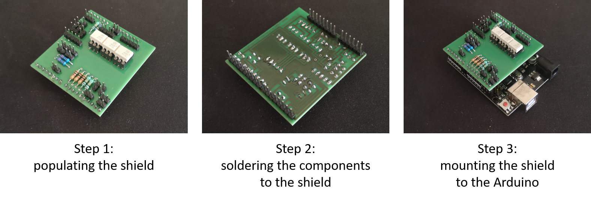
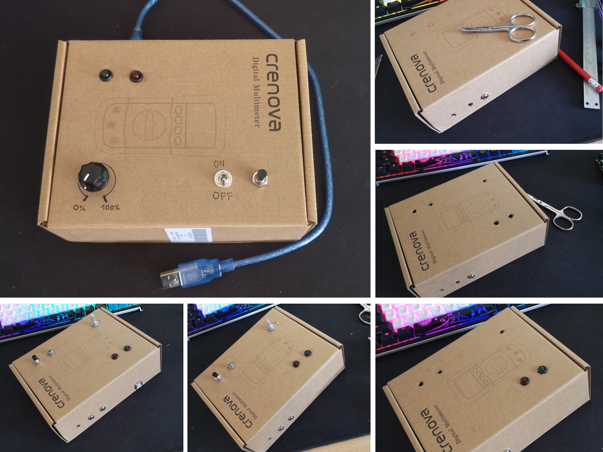
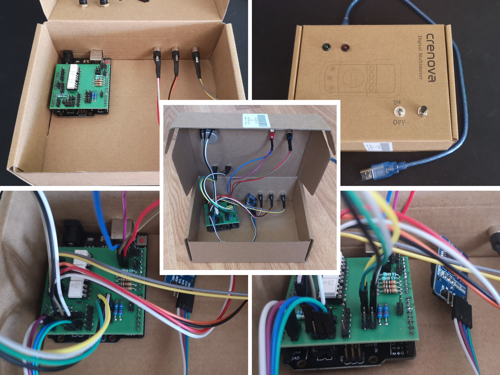

# Summer School 2020 - Arduino Interactive

###### _The project was created with [Platform IO](https://platformio.org/)_

## Table of Contents

1. [Introduction](#introduction)
2. [Architecture](#architecture)
3. [The Prototype](#the-prototype)
    * [Building Process](#building-process)
    * [Produced Photo Series](#produced-photo-series)

## Introduction

This project was created during the [Summer School - Arduino Interactive](https://creativemediasummer.fhstp.ac.at/arduino-interactive1/) workshop from UAS St. Pölten. It is based around the Arduino platform and is a prototype on how to control a digital camera with a micro controller. The aim of the project was to record a given time interval (in seconds) as a time lapse with given length (in seconds) and frames per second, by triggering the image capture of the camera every capture time interval, which was calculated from the mentioned input parameters. The captured images where combined to create a time lapse video.

## Architecture

The Project is based around the Arduino Platform. An Arduino Uno board is used to trigger the image capture process of a digital camera. The Arduino therefore is equipped with a custom shield which allows to connect multiple sensors like LDR, piezo, etc. and peripheral devices such as an real time clock. These sensors can be used to act as the trigger, e.g. the LDR could be used as a photoelectric barrier.

This project utilizes an infrared LED, one button, one switch, an LDR and, an DS3231 real time clock. The infrared LED is used to communicate with the camera and sends a specified sequence (`captureImage()`) to the camera, which triggers a image capture process.
The switch is used to change between the two mode, which are automatic and manual (testing) mode. In manual/testing mode is for manual image recording; if the button gets pressed while in this mode a image capture is triggered.
In automatic mode the LDR is used to measure the brightness of the surroundings and detect a sunset, which triggers the recording of an image sequence which can then be converted into a short timelapse clip. The real time clock serves as a backup trigger. If the LDR is not able to detect sunset, the RTC will trigger the recording at a pre determined time (meteorological sunset as unix time saved in `static const uint32_t recordingStartTime`)

## The Prototype

The Prototype is build out of the following components:

* 1x Arduino Uno Board or Clone
* A custom shield for Arduino Uno
    * 1x 1M Ohm Resistor
    * 3x 10k Ohm Resistor
    * 3x 1k Ohm Resistor
    * 2x 220 Ohm Resistor
    * 3x 4N35 Optocoupler + Socket
    * 2x 20Pin Header
    * 1x Piezo
    * 1x LDR
    * 1x Button
    * 1x Switch
    * 1x 10k Potentiometer
    * 2x LED + Socket
    * 1x Shield PCB
    * 1x Stereo aux cable
    * 1x Mono aux cable
    * 1x Stereo aux socket
    * 2x Mono aux socket
* 1x DS3231 real time clock
* 1x IR LED (to trigger image capture of the camera)
* female female jumper

### Building Process

First step in building the prototype was to build the shield. This was done by fist populating the shield according to the wiring diagram. After populating the shield, the components were soldered to the shield. Last step of assembling the shield was to mount it on the Arduino and test soldered connections with some simple example sketches like `blink.ino`.

The next step after building and testing the shield was to build an appropriate housing. The housing had to accommodate both the electronics and interfaces for the AUX cables, buttons and LEDs. For the sake of simplicity, a small carton was used and t he holes for the connections were into the box. After cutting the holes the button, the switch, the potentiometer, the LEDs and the aux sockets were mounted in those holes.

The final step  of building the prototype was to unit the housing and the electronics. The Arduino was placed inside the box and the external interfaces were connected to the corresponding pins. After that some final tests were done to check if the buttons, LEDs, etc. were still working as intended.

### Produced Photo Series

Here is a short video which summarizes the building process and shows a short timelapse recorded with this project.

